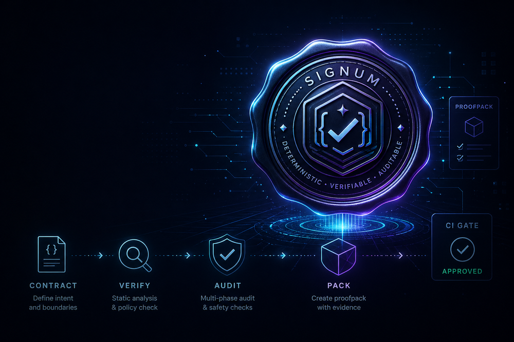

<p align="center">
  
</p>

# Signum

**A deterministic proof gate for agentic software development.**

Signum helps teams use AI coding agents more safely by turning every change into a contract-driven, auditable workflow.

Instead of trusting that an agent “probably did the right thing”, Signum asks for evidence:

- What was the contract?
- What changed?
- Which checks passed?
- What risks were found?
- What artifacts prove the result?
- Is this safe enough to merge?

At the end, Signum produces a **proofpack**: a structured evidence bundle that CI and humans can inspect.

---

## Why Signum?

AI agents can move fast, but fast changes need reliable boundaries.

Signum adds a release-style verification layer around agentic work:

- **Contract-first execution** — define intent, scope, and acceptance criteria before implementation.
- **Deterministic checks** — validate what can be checked without relying on model judgment.
- **Policy scanning** — catch risky code patterns, dependency changes, secrets, and incomplete work.
- **Proofpack output** — package evidence into a structured artifact.
- **GitHub-ready CI gate** — make merge decisions easier to review.

Signum is not a replacement for engineering judgment. It is a guardrail system that makes agentic changes easier to inspect, reproduce, and trust.

---

## How it works

Signum follows a simple flow:

```text
Contract → Execute → Audit → Pack → CI Gate
```

### 1. Contract

A change starts with a contract: the requested outcome, boundaries, risks, and acceptance criteria.

### 2. Execute

The implementation runs against the contract. Signum keeps the work tied to the original intent.

### 3. Audit

Signum runs deterministic checks and policy scans. Optional reviewer tools can add additional review signals.

### 4. Pack

Signum creates a proofpack: a structured evidence bundle containing the contract, diff, checks, audit summary, and decision metadata.

### 5. CI Gate

GitHub Actions can validate the proofpack and expose the result as a merge gate.

---

## What Signum produces

The `.signum/` directory is a structured registry/state/archive namespace; normal runs do not create root artifact files or root runtime dirs directly in the root `.signum/` folder.

- Normal runs do not create root runtime dirs like `.signum/reviews/`.
- resume checks use the registry first, with root `.signum/contract.json` only as a legacy import signal.

A Signum run writes canonical artifacts under:

```text
.signum/contracts/<contractId>/
```

Typical artifacts include:

```text
contract.json
contract-engineer.json
contract-policy.json
combined.patch
execute_log.json
mechanic_report.json
policy_scan.json
holdout_report.json
audit_summary.json
proofpack.json
```

The most important output is:

```text
proofpack.json
```

This is the evidence bundle used by CI and reviewers.

---

## Quick start

### Requirements

Signum expects a minimal local toolchain (>= v4.18.0):

```text
bash
git
jq
python3
```

### Initialize a project

Use the canonical init command:

```bash
/signum:init --harness
```

For Claude Code usage, install the Claude Code CLI according to your environment.

For Codex App usage, Signum ships a direct-install manifest at `.codex-plugin/plugin.json`, a repo-level marketplace at `.agents/plugins/marketplace.json`, and the marketplace plugin root at `platforms/codex/.codex-plugin/plugin.json`. In **Plugins -> Add marketplace**, use:

```text
Source: heurema/signum
Git ref: main
Sparse paths: leave blank
```

If you need sparse checkout for the marketplace install, include `.agents/plugins` and `platforms/codex`. Include `.codex-plugin` only for direct local-folder installs. For pinned installs, use `v4.21.2` or a newer release tag.

In Codex, invoke the workflow with a prompt such as:

```text
Use Signum to add a health check endpoint that returns {status: ok}
```

Optional reviewer tools may be used when available, but Signum keeps deterministic checks separate from model-based review.

### Run local deterministic checks

```bash
bash scripts/run-deterministic-tests.sh
```

### Run clean-room smoke

```bash
bash scripts/run-cleanroom-smoke.sh
```

For a deeper pre-publish check:

```bash
SIGNUM_CLEANROOM_FULL=1 bash scripts/run-cleanroom-smoke.sh
```

### Validate a proofpack

```bash
python3 scripts/validate_proofpack.py \
  .signum/contracts/<contractId>/proofpack.json \
  --repo-root .
```

---

## GitHub CI gate

Signum includes a GitHub Actions template for validating proofpacks in CI.

The CI path is intentionally deterministic:

- no hidden background work;
- no required external AI reviewer;
- no secrets needed for deterministic tests;
- pinned GitHub Actions refs;
- fixed Ubuntu runner label;
- clean-room smoke coverage.

The high-risk PR intake gate is intentionally strict. PRs touching sensitive paths such as workflows, scripts, command orchestration, or policy logic may require maintainer review or override.

---

## Safety model

Signum separates three kinds of evidence.

### Deterministic evidence

Checks that can run without model judgment:

- proofpack validation;
- policy scanner;
- DSL runner validation;
- artifact path guards;
- command renderer parity;
- clean-room smoke tests.

### Model-assisted review

Optional reviewer outputs can be included when available, but they are treated as review signals, not as the only source of truth.

### Human review

Large or high-risk changes still require human judgment. Signum makes that review easier by packaging the relevant evidence.

---

## Policy scanner

Signum includes a deterministic policy scanner with stable rule IDs.

It can detect patterns such as:

- dynamic code execution;
- XSS sinks;
- SQL injection patterns;
- shell injection risks;
- weak crypto;
- suspicious incomplete code markers;
- dependency additions.

False positives can be explicitly suppressed with a visible rule-based marker:

```text
SIGNUM_POLICY_ALLOW:<RULE_ID>:<reason>
```

Critical findings are not suppressible by default.

---

## Proofpack validation

Proofpacks are validated before CI consumes their result.

The validator checks:

- required fields;
- schema and Signum version;
- decision metadata;
- artifact references;
- safe relative paths;
- optional removal evidence shape when present.

Run it directly:

```bash
python3 scripts/validate_proofpack.py path/to/proofpack.json --repo-root .
```

---

## Command renderer

The main Signum command is generated from fragments.

Runtime command files remain checked in, but renderer checks ensure fragments reproduce them byte-for-byte:

```bash
python3 scripts/render_signum_command.py \
  --manifest commands/signum.fragments/manifest.json \
  --output commands/signum.md \
  --check
```

Claude Code overlay rendering is checked separately:

```bash
python3 platforms/claude-code/scripts/render_signum_command.py \
  --manifest platforms/claude-code/commands/signum.fragments/manifest.json \
  --output platforms/claude-code/commands/signum.md \
  --check
```

---

## When to use Signum

Use Signum when:

- AI agents are modifying important code;
- changes need auditability;
- PRs should include structured evidence;
- you want deterministic gates before merge;
- you need a repeatable contract-first workflow.

Signum is especially useful for:

- AI coding agent workflows;
- internal developer tools;
- CI/CD guardrails;
- security-sensitive automation;
- multi-agent development experiments.

---

## When not to use Signum

Signum may be too heavy if:

- you only need a simple one-off script;
- there is no CI or review process;
- you do not need audit artifacts;
- you want fully autonomous merging without human oversight.

Signum is designed to make agentic work safer, not invisible.

---

## Current limitations

Signum is a stabilized baseline, not a full production certification system.

Known limitations:

- policy scanning is still regex-based, not a full semantic parser;
- optional reviewer tools depend on external CLI availability and authentication;
- GitHub-hosted runner images can still receive upstream patch updates;
- clean-room smoke is not a real package publish/install test;
- remote Emporium push is not tested by the local smoke path;
- high-risk PRs may still require maintainer review or override.

---

## Development

Run the deterministic suite:

```bash
bash scripts/run-deterministic-tests.sh
```

Run clean-room smoke:

```bash
bash scripts/run-cleanroom-smoke.sh
```

Run evals:

```bash
python3 evals/run.py
```

Run renderer checks:

```bash
python3 scripts/render_signum_command.py \
  --manifest commands/signum.fragments/manifest.json \
  --output commands/signum.md \
  --check

python3 platforms/claude-code/scripts/render_signum_command.py \
  --manifest platforms/claude-code/commands/signum.fragments/manifest.json \
  --output platforms/claude-code/commands/signum.md \
  --check
```

---

### Maintainer release process

Signum includes a maintainer release path for syncing the plugin entry with the Emporium marketplace.

- **Release smoke test**: run `bash lib/release-smoke.sh` before publishing release metadata.
- **Marketplace sync**: the `Sync Emporium marketplace entry` workflow updates `heurema/emporium/.claude-plugin/marketplace.json`.
- **Codex plugin metadata**: `.codex-plugin/plugin.json` defines the direct Codex App install manifest; `.agents/plugins/marketplace.json` points marketplace installs at `platforms/codex/.codex-plugin/plugin.json`, which loads `platforms/codex/SKILL.md`.
- **Automation secret**: non-dry-run cross-repo sync requires `EMPORIUM_SSH_KEY`.
- **Manual trigger**: the workflow supports `workflow_dispatch` so maintainers can run a controlled release dry-run or sync.
- **Release trigger**: the workflow also runs on release publication so marketplace metadata stays aligned with Signum releases.

This is maintainer-facing release documentation. It does not change the user-facing Signum runtime flow.

---

## Philosophy

Signum is built around a simple principle:

> AI-generated changes should be easy to inspect, reproduce, and verify.

A good agentic workflow should not ask reviewers to trust invisible reasoning.  
It should produce a clear contract, deterministic checks, and a verifiable proofpack.

Signum is the seal on that process.
